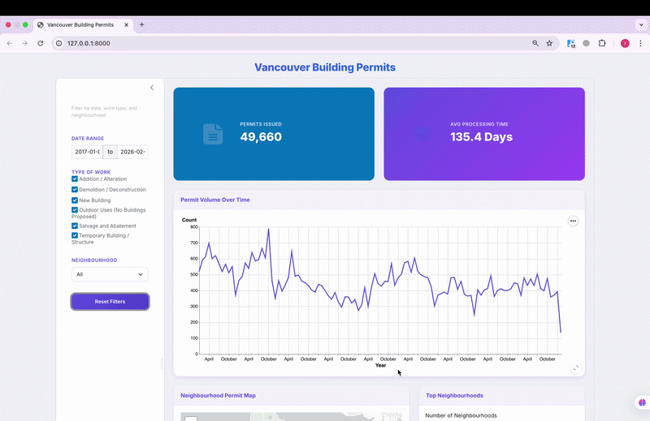

# City of Vancouver Building Permits Dashboard

An interactive dashboard built with **Python Shiny** to explore Building Permit data from the City of Vancouver (2017–present).

This dashboard enables real estate developers, agents, city planners, and stakeholders to analyze construction activity, approval timelines, and neighbourhood development trends across Vancouver through interactive visuals and dynamic filtering.

## Demo



## Motivation

Urban development decisions depend on understanding where construction activity is happening, how quickly permits are approved, and how trends are evolving over time.

However, raw permit datasets are large, difficult to interpret, and not immediately actionable for decision-makers.

This dashboard was built to:

- Transform raw building permit data into clear, interactive insights
- Help real estate professionals identify high-growth neighbourhoods
- Provide visibility into permit approval timelines
- Support data-driven planning and investment decisions

By making development trends easy to explore and compare, the dashboard enables faster and more informed decision-making.

## Insights It Delivers

Understanding development patterns requires visibility into:

- 📍 Which neighbourhoods are experiencing the highest construction activity
- ⏱ How long permits take to be approved
- 📊 How permit volume evolves over time
- 🔎 How trends differ across permit categories and areas

The dashboard provides:

- An **interactive neighbourhood map** displaying permit distribution
- **Average permit processing time** (issued date − applied date) by neighbourhood and category
- **Total permit counts** within selected filters
- **Permit volume trends over time** to identify growth patterns
- A summary of **top neighbourhoods by permit volume**

## Deployments

- [Stable Build](https://connect.posit.cloud/oswingan/content/019c9398-bb34-8e51-81f9-ab408b2265d5)
- [Preview Build](https://connect.posit.cloud/oswingan/content/019c939c-0035-bdf2-f7f3-3c47ab720907)

## Installation

### 1. Clone the repository

```bash
git clone https://github.com/UBC-MDS/DSCI-532_2026_25_building_permits.git
```

```bash
cd DSCI-532_2026_25_building_permits
```

### 2. Create or update the conda environment

```bash
conda env create -f environment.yml || conda env update -f environment.yml
```

```bash
conda activate 532_group_25
```

### 3. Run the dashboard

```bash
shiny run --reload src/app.py
```

Then open the local URL shown in your terminal (usually `http://127.0.0.1:8000`).

## Contributing

Please see:

➡️ **[CONTRIBUTING.md](CONTRIBUTING.md)**

For contribution guidelines, branching strategy, coding standards, and project structure.
