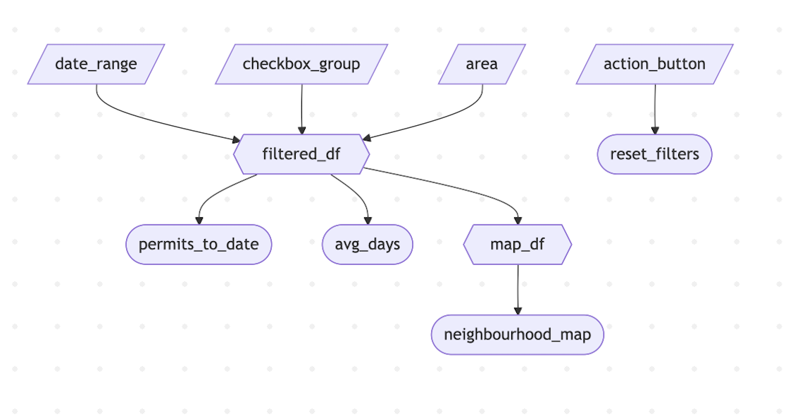

# Phase 2: App Specification

### 2.1: Updated Job Stories

| # | Job Story | Status | Notes |
|---|-----------|--------|-------|
| 1 | As a real estate developer, I want to visually see permit distribution per neighbourhood on an interactive map I can click/filter on. This will allow me to identify neighbourhoods with high development activity and potential profitable investment areas. | In Progress | Pending implementation of neighbourhood_map and map_df in 2.2 |
| 2 | As a real estate developer, I want to see the average time it takes for a permit to be approved by the city (issued date minus applied date) by neighbourhood and category so that I can see overall approval timelines when planning a development project. | Pending M2 | Requires calculation of average processing time from the filtered_df. |
| 3 | As an end user, when I adjust the date range, permit type, or neighbourhood filters, I want all the dashboard visuals to update dynamically so I can change my view of the dashboard on the fly. | Pending M2 | Requires reactive calculation using filtered_df. |
| 4 | When analyzing development activity in Vancouver, I want to see the total number of permits issued within my preferred filters so I can quickly gauge the construction activity for specific times and areas. | Pending M2 | Requires filtered_df + permits_to_date.
| 5 | As an end user of the dashboard, I want a fast way to reset my filters so that I can reset my filters on demand and return to a full city view or show stakeholders different development behaviour on the fly based on different filters. | Pending M2 | Requires reset_filters reactive effect|

### 2.2: Component Inventory 

| ID | Type | Shiny Widget / Renderer | Depends on | Job story |
|---|---|---|---|---|
| date_range | Input | `ui.input_date_range()` | — | #1, #3, #4 |
| checkbox_group | Input | `ui.input_checkbox_group()` | — | #1, #3, #4 |
| area | Input | `ui.input_select()` | — | #1, #3, #4 |
| reset_filters | Reactive effect | `@reactive.effect` + `@reactive.event(input.action_button)` | `input.action_button` | #5 |
| filtered_df | Reactive calculation | `@reactive.calc` | `input.date_range, input.checkbox_group, input.area, permits_df` | #1, #3, #4 |
| permits_to_date | Output | `ui.output_text()` + `@render.text` | `filtered_df` | #4 |
| avg_days | Output | `ui.output_text()` + `@render.text` | `filtered_df` | #2 |
| map_df | Reactive calculation | `@reactive.calc` | `filtered_df` | #1 |
| neighbourhood_map | Output | `ui.output_widget()` + `@render_widget` | `map_df` | #1 |

### 2.3: Reactivity Diagram 

### 2.4: Calculation Details

#### Reactive Calc 1: `filtered_df`

- **Inputs**: 

    - `input.date_range`
    - `input.checkbox_group`
    - `input.area`
    - `permits_df`

- **Transformations**: 

    Filters the original raw `permits_df` dataset so it includes:
     - permits issued within the inputted date_range
     - permits whose type matches the selected permit type in the checkbox group filter
     - permits from the selected neighbourhoods/areas (defauls to "All" all neighbourhoods if selected)
    
- **Outputs That Consume filtered_df**: 

    - `permits_to_date`: count of total permits based on current filters
    - `avg_days`: average number of days it takes to process or grant a permit based on current filters
    - `map_df`: prepares mapping data to create interactive map from the filtered_df

#### Reactive Calc 2: `map_df`

- **Inputs**: 

    - `filtered_df`

- **Transformations**: 

    Further filters the `filtered_df` dataset to select only the longtitude and latitude fields along with their counts or counts by neighbourhood to get a structured dataset for plotting an interactive map containing each neighbourhood in Vancouver. 
    
- **Outputs That Consume filtered_df**: 

    - `neighbourhood_map`: plots the interactive map from `map_df`.

